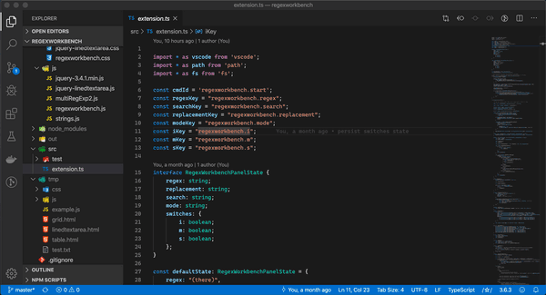
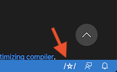

# Preview

Just click the regex star at the bottom right to get started.

## Description

A regular expression workbench for Visual Studio Code in the style of [Komodo's](https://www.activestate.com/products/komodo-ide/).  Just click on the slash-star-slash icon in the lower right.

Currently supports match, match all, split, replace, and replace all.

## How does it work?

The workbench uses the [PCRE2](https://www.pcre.org/) (Perl Compatible Regular Expressions) library, compiled to WebAssembly.  See [@stephen-riley/pcre2-wasm](https://github.com/stephen-riley/pcre2-wasm) for that project.  PCRE2 is a significant upgrade compared to the current Javascript RegExp functionality (though [there is hope!](https://v8.dev/features/regexp-match-indices)).

Some important things to note about PCRE2 as used in this extension:

* This PCRE2 is compiled with [UTF-16 LE](https://en.wikipedia.org/wiki/UTF-16#Byte_order_encoding_schemes) character units under the hood, so you should have no problem with Unicode characters.
* It does _not_ support Python replacement group references; eg. `"\1 \2"`.  You must use `"$1 $2"`.  `\1` is still supported as a backreference in regular expression patterns; eg. `((?i)rah)\s+\1`.
* Named capture groups are supported in three syntaxes: `(?<name>...)`, `(?'name'...)`, and `(?P<name>...)`.
* You can use named capture groups in the replacement text with the syntax `${name}`.

## Why the delay in loading this extension?

At the time of writing, the V8 Javascript engine running Visual Studio Code _always_ runs WebAssembly modules through its [TurboFan optimizing compiler](https://v8.dev/blog/launching-ignition-and-turbofan).  PCRE2 has some seriously nontrivial logic in it that TurboFan takes 6-7 seconds to process.  You will therefore notice a similar delay between launching vscode and seeing the Regular Expression Workbench icon appearing in the lower right.  See [this repo](https://github.com/stephen-riley/pcre2-wasm/tree/turbofan-bug-demo) for further information.

## Sideloading from a local build

If you want to run a customized version, here's how to sideload your own build.

Make sure you have Node.js installed, then run:

`npm install -g vsce`

Clone the repo and `cd` into its directory, then run:

`vsce package`

`code --install-extension regexworkbench-<version>.vsix`

(The `version` comes from `package.json`.)
